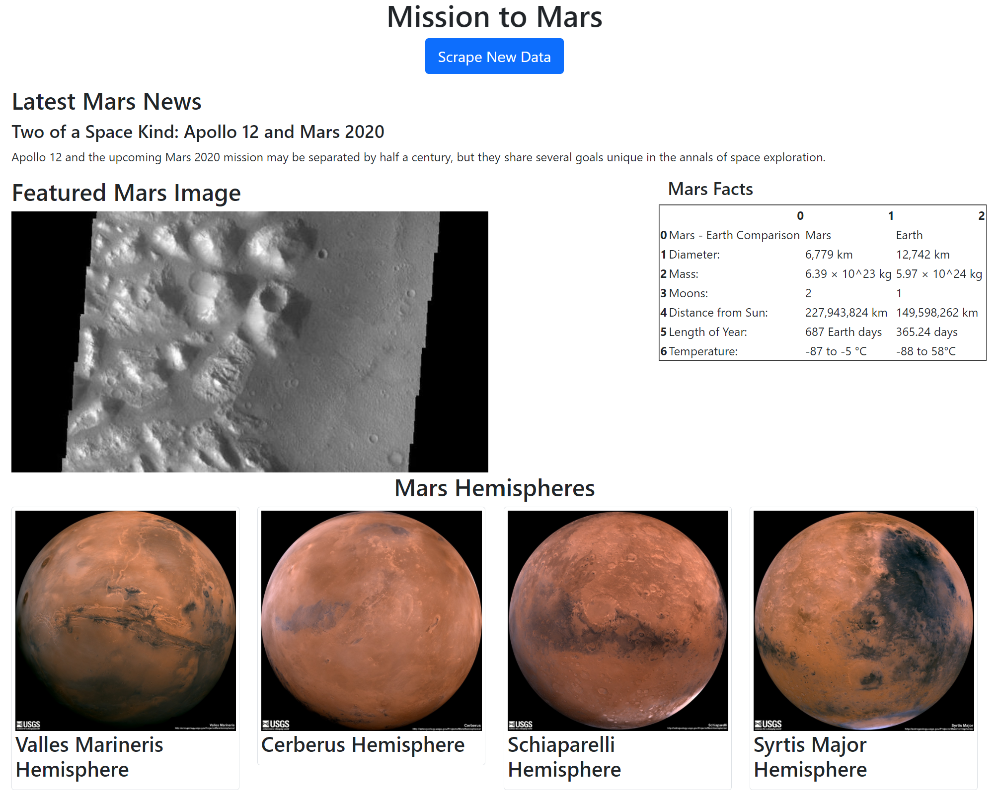

# Mission to Mars Web Scraping

Web application that scrapes various websites for data related to Mission to Mars and displays the information in a single HTML page. Web scraping conducted with Jupyter Notebook, BeautifulSoup, Pandas, and Requests/Splinter. Websites scraped include, [MARS Planet Science](https://redplanetscience.com/), [Jet Propulsion Laboratory](https://spaceimages-mars.com/), [Galaxy Facts](https://galaxyfacts-mars.com/), and [Astropedia](https://marshemispheres.com/).

## Mission to Mars

## Steps

- Scrape the [Mars News Site]( https://redplanetscience.com/) and collect the latest News Title and Paragraph Text.
- Use splinter to navigate the [Featured Space Image site](https://spaceimages-mars.com/) and find the full size .jpg image url for the current featured Mars image.
-	Visit the [Mars Facts webpage](https://galaxyfacts-mars.com/) and use Pandas to scrape the table containing facts about the red planet.
-	Use Pandas to convert the data to a HTML table string.
-	Visit the [astrogeology site](https://marshemispheres.com/) and click each link to obtain high resolution images for each of Mar's hemispheres.
-	Use a Python dictionary to store the data with the keys img_url and title.
-	Append the dictionary with the image url string and the hemisphere title to a list. This list contains one dictionary for each hemisphere.
-	Convert the Jupyter notebook into a Python script called scrape_mars.py with a function called scrape that executes all of the scraping code from above and returns one Python dictionary containing all of the scraped data.
-	Create a route called /scrape that will import the scrape_mars.py script and call scrape function.
-	Store the return value in Mongo as a Python dictionary.
-	Create a root route / that will query Mongo database and pass the mars data into an HTML page to display the data.
-	Create index.html that will take the mars data dictionary and display the data in HTML elements.
-	Use Splinter to navigate the sites and BeautifulSoup to parse out the data.
- Use Pymongo for CRUD applications.
- Use Bootstrap to structure the HTML page.

## Authors

- **David W. Mueller**
  - [LinkedIn Profile](https://www.linkedin.com/in/davidwaltermueller/)
  - davemuelle@gmail.com

## Acknowledgments

- Michigan State University Data Analytics Bootcamp; June 12, 2021.
